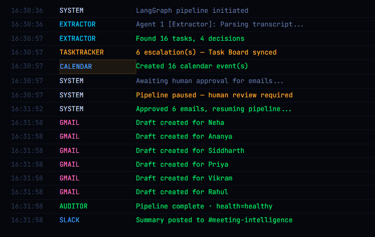
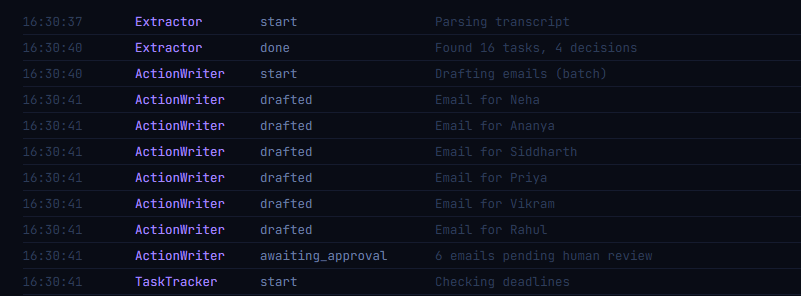
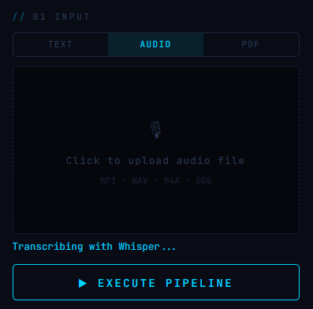
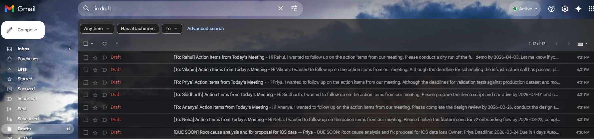

# Meeting Intelligence System (MIS)
### ET Gen AI Hackathon 2026 · Problem Statement 2: Agentic AI for Autonomous Enterprise Workflows


> **"An enterprise team finishes a meeting. Within 60 seconds, every stakeholder has a personalized email, every deadline is on their calendar, overdue items are escalated, and the CTO has a full audit trail of every decision the AI made — with zero manual effort."**

---

## The Problem

Every knowledge-work team wastes 30-60 minutes after every meeting doing the same manual work:

- Someone writes follow-up emails to 6 different people
- Someone else manually creates calendar reminders
- Action items get copy-pasted into Jira or Notion
- Overdue tasks get discovered by accident two weeks later
- Nobody remembers what was decided three months ago

For a 50-person team running 10 meetings a week, this is **270 minutes of wasted time every single week** — work that adds no value, just documents work that already happened.

MIS eliminates all of it.

---

## What It Does

MIS is a **LangGraph-orchestrated multi-agent system** that takes a raw meeting transcript — or an MP3 recording — and autonomously executes the full post-meeting workflow. Five specialized agents run in sequence, each with a defined role, and the pipeline pauses at a human approval gate before any email is sent.

### The 5 Agents

**Agent 1 — Extractor**
Parses the transcript and extracts every task, owner, deadline, and decision with a confidence score (0-100%) on each item. Queries ChromaDB memory from past meetings to identify recurring issues — people who keep missing deadlines or tasks that keep reappearing. Low confidence items are flagged for human attention.

**Agent 2 — Action Writer**
Drafts personalized follow-up emails for every task owner in a single batch LLM call. If someone has recurring unresolved tasks from past meetings, the email tone is automatically made more urgent. All emails are drafted but not sent — they go to the approval gate first.

**⏸ Human-in-the-Loop Approval Gate**
The pipeline pauses here. A manager sees every drafted email with the recipient, subject, and full body. They can approve, edit the body inline, or reject each email individually. Only approved emails proceed. This is a deliberate design decision — enterprise AI should never send communications without human oversight.

**Agent 3 — Task Tracker**
Checks every extracted deadline against today's date. Overdue tasks trigger real escalation emails sent immediately to the manager's inbox. At-risk tasks (due within 2 days) create draft escalation emails. The Task Board in SQLite is updated with the correct status in real time.

**Agent 4 — Calendar Agent**
Creates Google Calendar all-day events for every task deadline, with email reminders 24 hours before and popup reminders 1 hour before. The event description includes the meeting ID, task owner, and confidence score for full traceability.

**Agent 5 — Auditor**
Builds a complete timestamped audit trail of every decision made across the pipeline — which agent ran when, what it found, what warnings were raised, what actions were taken. Reports pipeline health as `healthy` or `degraded`. Saves the full report to `audit_report.json` and posts a structured summary to Slack.

---

## Who Uses This and How

MIS is designed as an **internal enterprise tool deployed for one team** — think of it as Jira or Asana, but fed by meeting audio instead of manual input.

### Typical Users

**The Engineering Manager / CTO**
Runs MIS after every sprint planning, architecture review, or stakeholder call. Reviews the approval gate in 60 seconds — approves emails, maybe edits one or two. The rest is automatic. Over time, uses the recurring issues panel to identify team members who consistently miss deadlines.

**The Product Manager**
Uses MIS after every roadmap meeting or cross-functional sync. Uploads the meeting recording as an MP3 — no need to take notes at all. Gets a clean task board showing who owns what across all recent meetings.

**The Team Lead**
Uses the Task Board daily as a Kanban view of all open tasks across meetings. Marks tasks done as they're completed. Gets automatic escalation emails when something goes overdue — without having to chase people manually.

### Deployment Model

```
Week 1:  Team installs MIS, runs it after first meeting
         → Tasks saved to SQLite, meeting stored in ChromaDB

Week 2:  Second meeting runs
         → System detects Vikram has 3 open tasks from last week
         → Action Writer automatically adds urgency to Vikram's email
         → Manager sees this flagged in the approval gate

Month 2: After 8 meetings, the system has institutional memory
         → "API rate limiting strategy has been unresolved for 6 weeks"
         → "Priya has 12 open tasks across 4 meetings"
         → These insights surface automatically — no dashboards to check
```

### Input Flexibility

| Input Type | How It Works |
|---|---|
| **Text** | Paste raw transcript directly |
| **Audio (MP3/WAV/M4A)** | Upload recording → Whisper transcribes locally on GPU → pipeline runs |
| **PDF** | Upload meeting notes or documents → PyMuPDF extracts text → pipeline runs |

The system handles natural speech without labels — if someone says "Hi I'm Sara, I'll have the mockups done by Friday", the Extractor correctly assigns the task to Sara with a confidence score reflecting how clearly it was stated.

---

## Demo Screenshots

### Live Agent Log — LangGraph pipeline executing in real time


### Full Pipeline View — Tasks with confidence scores, Escalations, Calendar


### Human-in-the-Loop Approval Gate — Review before sending


### Audit Trail — Every agent decision timestamped


### Task Board — Persistent SQLite across meetings, Open / Overdue / Done


### Audio Input — Whisper transcription from MP3 recording


### Gmail — [OVERDUE] escalation emails sent automatically


### Gmail Drafts — Personalized follow-up emails per person


### Slack — Structured meeting report to #meeting-intelligence


---

## Architecture

```
Input Layer
──────────────────────────────────────────────
Text Transcript  │  MP3/WAV (Whisper)  │  PDF (PyMuPDF)
                 │
                 ▼
LangGraph State Machine
──────────────────────────────────────────────
┌─────────────────────────────────────────────────┐
│                                                 │
│  [Extractor] ──────────────────────────────┐   │
│   • LLM extraction with confidence scoring │   │
│   • ChromaDB query for past meeting memory │   │
│   • Recurring issue detection via SQLite   │   │
│   • JSON repair self-correction on failure │   │
│                                            ▼   │
│  [Action Writer] ──────────────────────────┐   │
│   • Single batch LLM call for all emails  │   │
│   • Urgency adjustment for recurring issues│   │
│   • Fallback template if LLM fails        │   │
│                                            ▼   │
│  ⏸  HUMAN APPROVAL GATE (LangGraph pause) │   │
│   • Manager reviews / edits / rejects     │   │
│   • Pipeline resumes on submit            │   │
│                                            ▼   │
│  [Task Tracker] ───────────────────────────┐   │
│   • Deadline vs today comparison          │   │
│   • Overdue → real email sent             │   │
│   • At-risk → escalation draft            │   │
│   • SQLite status sync                    │   │
│                                            ▼   │
│  [Calendar Agent] ─────────────────────────┐   │
│   • Google Calendar event per deadline    │   │
│   • Email + popup reminders               │   │
│                                            ▼   │
│  [Auditor] ────────────────────────────────┐   │
│   • Full timestamped audit trail          │   │
│   • Pipeline health: healthy / degraded   │   │
│   • audit_report.json saved               │   │
│                                            ▼   │
│  [Slack Notifier] ─────────────────────────┘   │
│   • Structured summary to channel         │   │
│                                                 │
└─────────────────────────────────────────────────┘
                 │
                 ▼
Output Layer
──────────────────────────────────────────────
Gmail API  │  Google Calendar API  │  SQLite  │  ChromaDB  │  Slack
```

**Self-correction:** Every LLM call has 3-attempt retry with 2s backoff. On JSON parse failure a repair prompt activates. Pipeline continues with fallback templates if all retries fail — it never crashes mid-run.

---

## Tech Stack

| Layer | Technology |
|---|---|
| Agent Orchestration | LangGraph (StateGraph, conditional edges, pause/resume) |
| LLM | Groq — llama-3.3-70b-versatile (free tier, no rate limits) |
| Audio Transcription | OpenAI Whisper (local, GPU-accelerated) |
| PDF Parsing | PyMuPDF (fitz) |
| Email | Gmail API (OAuth 2.0) |
| Calendar | Google Calendar API |
| Memory / RAG | ChromaDB (persistent vector store, cross-meeting memory) |
| Task Persistence | SQLite (task board, meeting history) |
| Backend | FastAPI + Server-Sent Events (live streaming to frontend) |
| Frontend | Vanilla HTML/CSS/JS — terminal UI with drag-to-resize panels |
| Notifications | Slack Incoming Webhooks |

---

## Setup

### Prerequisites
- Python 3.10+
- Google account
- Groq API key (free at [console.groq.com](https://console.groq.com))
- Google Cloud project with Gmail API + Calendar API enabled

### Install

```bash
git clone https://github.com/RAK2315/meeting-intelligence-system.git
cd meeting-intelligence-system
pip install -r requirements.txt
```

### Configure

Create a `.env` file in the project root:

```
GROQ_KEY=your_groq_key_here
SLACK_WEBHOOK=your_slack_webhook_here
```

Set up Google OAuth:
1. Go to [console.cloud.google.com](https://console.cloud.google.com)
2. Create a new project
3. Enable Gmail API and Google Calendar API
4. Go to APIs & Services → Credentials → Create OAuth Client ID (Desktop App)
5. Download JSON → rename to `credentials.json` → place in project root
6. Go to OAuth consent screen → Audience → add your Gmail as test user

### Run

```bash
uvicorn app:app --reload --port 8001
```

Open `http://localhost:8001`

On first run a browser window opens for Google OAuth — approve Gmail and Calendar access. A `token.pickle` file saves for subsequent runs.

---

## Project Structure

```
meeting-intelligence-system/
├── agents.py          # LangGraph pipeline — all 5 agent nodes + state
├── app.py             # FastAPI backend + SSE streaming + approval endpoint
├── index.html         # Frontend — terminal UI with resizable panels
├── requirements.txt   # Python dependencies
├── .env               # API keys (not committed)
├── credentials.json   # Google OAuth credentials (not committed)
├── images/            # README screenshots (1.png — 10.png)
└── README.md
```

---

## Evaluation Criteria Coverage

| Criterion | How MIS addresses it |
|---|---|
| **Depth of autonomy** | 5 agents run end-to-end. Gmail drafts, Calendar events, Slack posts, escalation emails — all automatic. Human only involved at the approval gate |
| **Error recovery** | 3-attempt LLM retry, JSON repair agent, graceful fallback templates. Self-correction events logged to audit trail |
| **Auditability** | Every agent action timestamped with agent name, action type, and detail. Full trail visible in UI drawer and saved to `audit_report.json` |
| **Real-world applicability** | Works with live audio via Whisper. Output in Gmail and Google Calendar. Slack for team visibility. SQLite persists across meetings |
| **Human-in-the-loop** | LangGraph pause/resume at approval gate. Manager reviews every email. Inline edit. Reject and skip. Pipeline resumes after submission |

---

## Impact Model

For a 50-person knowledge-work team running 10 meetings/week:

| Activity | Manual time | MIS time | Saving |
|---|---|---|---|
| Writing follow-up emails | 15 min/meeting | 0 min | 150 min/week |
| Tracking action items | 10 min/meeting | 0 min | 100 min/week |
| Chasing overdue tasks | 20 min/week | 0 min | 20 min/week |
| **Total** | | | **270 min/week (~4.5 hrs)** |

At ₹800/hr fully-loaded cost → **₹3,600/week saved per team → ₹1.87 lakh/year**

Across 100 enterprise teams → **₹1.87 crore/year** in recovered productive time.

The longer MIS runs, the more valuable it gets — recurring issue detection and cross-meeting memory compound over time, surfacing patterns that no manual process would catch.

---

## Built By

**Rehaan Ahmad Khan** · ET Gen AI Hackathon 2026 · Phase 2 Build Sprint