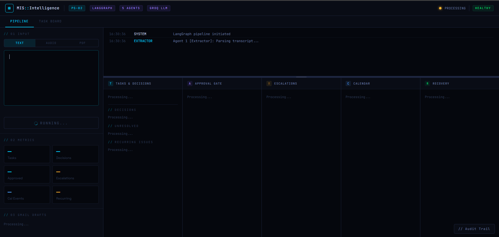
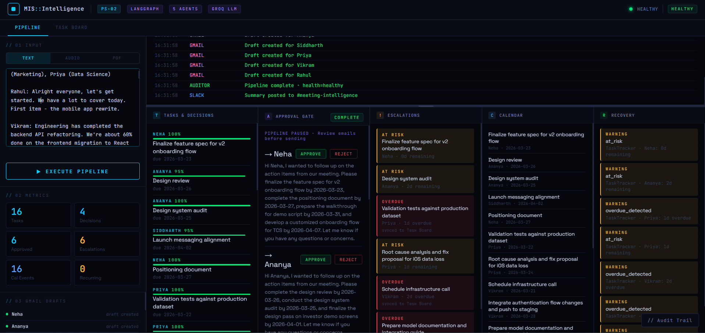
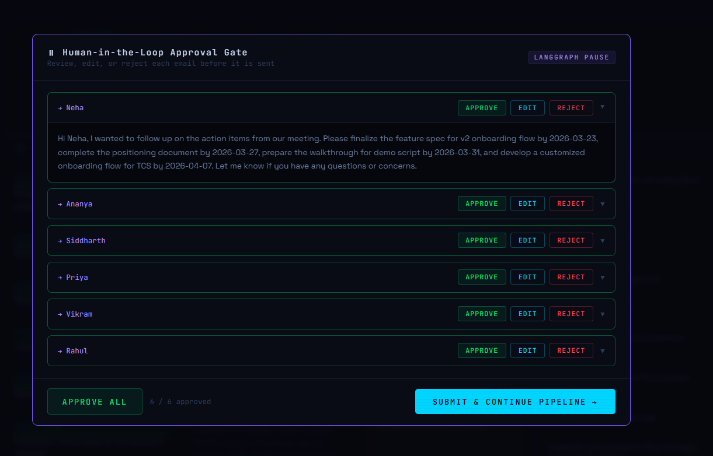
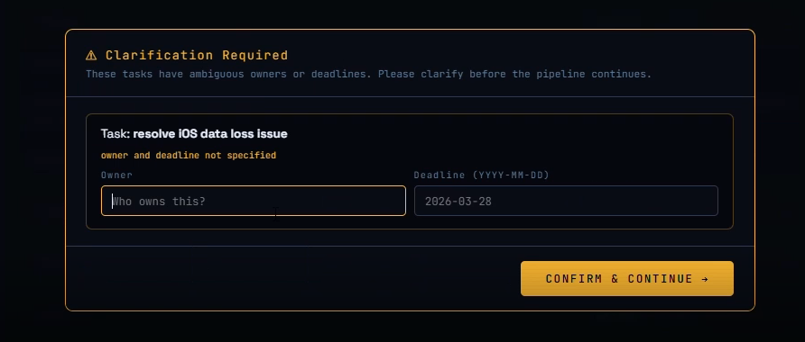
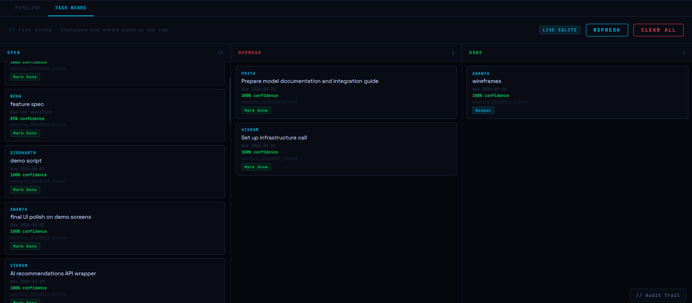
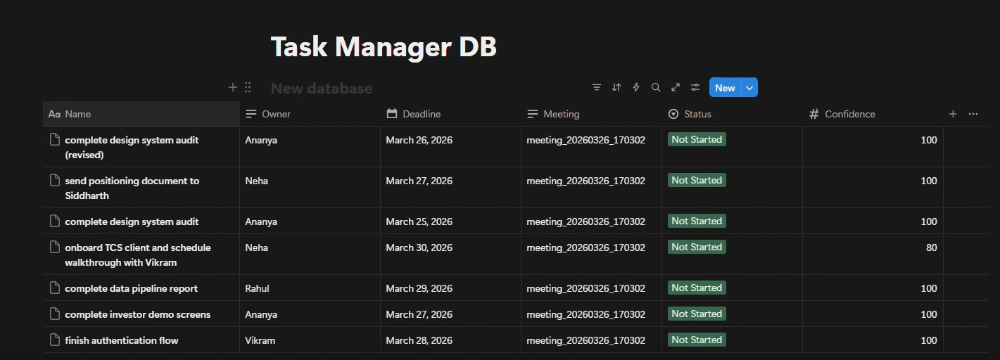
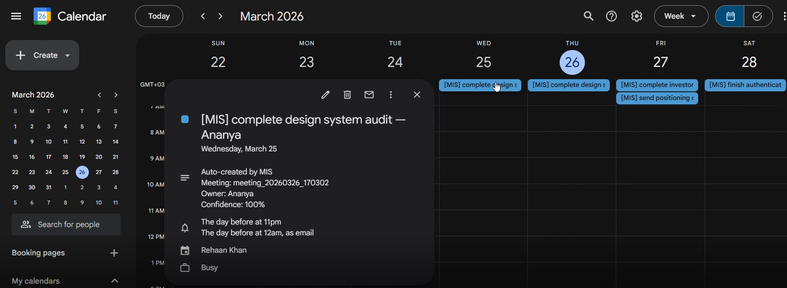
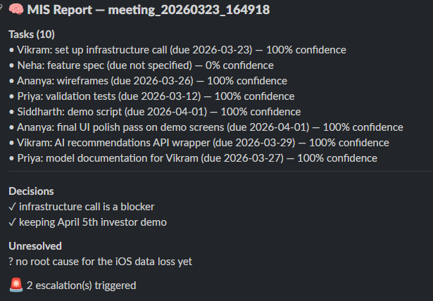
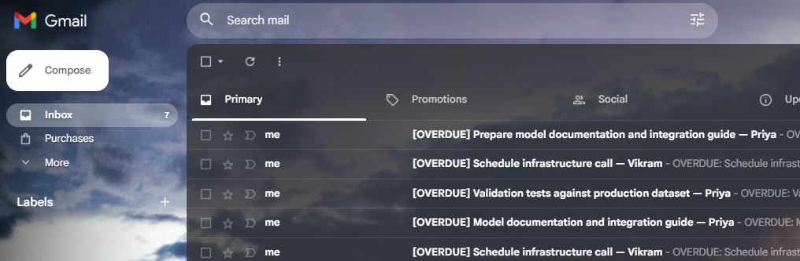

# Meeting Intelligence System (MIS)
### ET Gen AI Hackathon 2026 · Problem Statement 2: Agentic AI for Autonomous Enterprise Workflows



> **"An enterprise team finishes a meeting. Within 60 seconds, every stakeholder has a personalized email, every deadline is on their calendar, overdue items are escalated, Notion is updated, and the CTO has a full audit trail of every decision the AI made — with zero manual effort."**

---

## The Problem

Every knowledge-work team wastes 30–60 minutes after every meeting doing the same manual work:

- Someone writes follow-up emails to 6 different people
- Someone else manually creates calendar reminders one by one
- Action items get copy-pasted into Notion or Jira
- Overdue tasks get discovered by accident two weeks later
- Nobody remembers what was decided three months ago
- The same people miss the same deadlines — and nobody notices the pattern

For a 50-person team running 10 meetings a week, this is **270 minutes of wasted time every single week** — work that adds no value, just documents work that already happened.

MIS eliminates all of it.

---

## What It Does

MIS is a **LangGraph-orchestrated multi-agent system** that takes a raw meeting transcript, an MP3 recording, or a PDF of meeting notes — and autonomously executes the full post-meeting workflow. Five specialized agents run in sequence, the pipeline pauses at a human approval gate before any email is sent, and every decision is logged to a full audit trail.

### The 6-Node Pipeline

**Agent 01 — Extractor** `llama-3.3-70b`
Parses the transcript and extracts every task, owner, deadline, and decision with a confidence score (0–100%) on each item. Queries ChromaDB memory from past meetings to identify recurring issues — people who keep missing deadlines or tasks that keep reappearing. Low-confidence items (below 60%) are flagged for the clarification modal. JSON self-repair activates on malformed LLM output.

**Agent 02 — Action Writer** `llama-3.1-8b`
Drafts personalized follow-up emails for every task owner in a single batch LLM call. Smart model routing: the smaller 8b model handles generation for cost efficiency, while the 70b model handles reasoning. If someone has recurring unresolved tasks from past meetings, the email tone is automatically made more urgent. Fallback templates activate if the LLM fails.

**⏸ Human-in-the-Loop Approval Gate** `LangGraph interrupt`
The pipeline pauses here. A manager sees every drafted email with the recipient, subject, and full body. They can approve, edit the body inline, or reject each email individually. A separate clarification modal surfaces tasks with ambiguous owners or missing deadlines before the approval step — the manager fills them in and the pipeline continues. Only approved emails proceed. Zero emails sent without explicit human sign-off.

**Agent 03 — Task Tracker** `Python datetime`
Checks every extracted deadline against today's date. Overdue tasks trigger real escalation emails sent immediately to the manager's inbox. At-risk tasks (due within 2 days) create draft escalation emails. The Task Board in SQLite is updated with correct status in real time. Stall detection flags tasks with no updates in 48+ hours and sends a Slack alert.

**Agent 04 — Calendar + Notion** `Google APIs + Notion API`
Creates Google Calendar all-day events for every task deadline, with email reminders 24 hours before and popup reminders 1 hour before. Simultaneously writes one row per task to a Notion database — task name, owner, deadline, meeting ID, status (Not Started), and confidence score.

**Agent 05 — Auditor** `JSON + Timestamps`
Builds a complete timestamped audit trail of every decision made across the pipeline — which agent ran when, what it found, what warnings were raised, what model was used, what self-correction events fired. Reports pipeline health as `healthy` or `degraded`. Saves the full report to `audit_report.json` and posts a structured summary to Slack.

---

## Key Features

### Cross-Meeting Memory (ChromaDB RAG)
Every meeting is stored as a vector embedding in ChromaDB. Before extracting tasks, the Extractor queries this store to find recurring patterns — the same person having multiple open tasks across meetings, or the same issue being raised week after week. This context is injected into the Action Writer so email tone adjusts automatically based on history.

### Two Human-in-the-Loop Gates
1. **Clarification modal** — Tasks with no owner or ambiguous deadlines surface before the approval step. Manager fills in owner name and deadline, pipeline continues with corrected data.
2. **Approval gate** — Every drafted email is shown for review. Manager reads, edits, approves, or rejects per person. Nothing is sent until Submit is clicked.

### Stall Detection (SLA Breach Prevention)
A `/stalls` endpoint checks for tasks with no status update in 48+ hours. When triggered, it marks those tasks as stall-flagged and sends a Slack alert listing the stalled items. Prevents tasks from falling through the cracks between meetings.

### Smart Model Routing
- **llama-3.3-70b** for extraction, reasoning, confidence scoring (complex task)
- **llama-3.1-8b** for email drafting, JSON repair (generation task)

This reduces Groq API cost by ~4x compared to running everything through the 70b model, while maintaining quality where it matters.

### Self-Correction Loop
Every LLM call has 3-attempt retry with 2s backoff. On JSON parse failure, a repair prompt activates. If all retries fail, the pipeline continues with graceful fallback templates — it never crashes mid-run. All recovery events are logged to the audit trail.

---

## Input Flexibility

| Input Type | How It Works |
|---|---|
| **Text** | Paste raw transcript directly into the text box |
| **Audio (MP3/WAV/M4A/OGG)** | Upload recording → Whisper transcribes locally on GPU → pipeline runs |
| **PDF** | Upload meeting notes or documents → PyMuPDF extracts text → pipeline runs |

The system handles natural speech without structured labels — if someone says *"Hi I'm Sara, I'll have the mockups done by Friday"*, the Extractor correctly assigns the task to Sara with a confidence score reflecting how clearly it was stated.

---

## Demo Screenshots

### Full Pipeline View — Tasks, Escalations, Calendar, Notion, Recovery all populated


### Human-in-the-Loop Approval Gate — Review, edit, approve or reject each email


### Clarification Modal — Ambiguous tasks surfaced for human input


### Task Board — Persistent SQLite across meetings, Open / Overdue / Done


### Notion Database — One row per task, auto-created with full metadata


### Google Calendar — All-day deadline events with 24h email reminders


### Gmail — [OVERDUE] escalation emails + [DUE SOON] drafts + personalized follow-ups


### Slack — Structured meeting report posted to #meeting-intelligence


---

## Architecture

```
INPUT LAYER
──────────────────────────────────────────────────────────
Text Transcript  │  MP3/WAV (Whisper GPU)  │  PDF (PyMuPDF)
                          │
                          ▼
LANGGRAPH STATE MACHINE  (PipelineState TypedDict)
──────────────────────────────────────────────────────────
[01 Extractor]  llama-3.3-70b
  • Extract tasks, owners, deadlines, decisions
  • Confidence scoring (0.0–1.0) per task
  • ChromaDB query → recurring issue detection
  • Low-confidence tasks → clarification_needed flag
  • JSON self-repair on parse failure
        │
        ▼  (conditional edge: skip to Auditor if no tasks found)
[02 Action Writer]  llama-3.1-8b
  • Batch email drafting (one LLM call, all owners)
  • Urgency injection for recurring offenders
  • Fallback templates on LLM failure
        │
        ▼
[⏸ CLARIFICATION GATE]  — human fills in ambiguous owners/deadlines
[⏸ APPROVAL GATE]  — LangGraph interrupt, manager reviews all emails
        │
        ▼  (pipeline resumes on submit)
[03 Task Tracker]  Python datetime
  • Deadline vs today → OVERDUE / AT_RISK / on track
  • Overdue → real email sent via Gmail API immediately
  • At-risk → escalation draft created
  • SQLite status sync + stall detection (48h threshold)
        │
        ▼
[04 Calendar + Notion]  Google APIs + Notion API
  • Google Calendar all-day event per deadline
  • Email reminder 24h + popup reminder 1h before
  • Notion database row per task (name, owner, deadline, status, confidence)
        │
        ▼
[05 Auditor]  JSON + timestamps
  • Full timestamped audit trail, every agent action logged
  • Pipeline health: healthy / degraded
  • Save audit_report.json
        │
        ▼
[Slack Notifier]  Webhooks
  • Structured summary → #meeting-intelligence
  • Tasks, decisions, unresolved items, escalation count
        │
        ▼
OUTPUT LAYER
──────────────────────────────────────────────────────────
Gmail  │  Google Calendar  │  Notion DB  │  SQLite  │  ChromaDB  │  Slack

SELF-CORRECTION
──────────────────────────────────────────────────────────
3-attempt LLM retry → JSON repair agent → model fallback small→large
→ graceful degradation templates → all recovery events logged
```

---

## Tech Stack

| Layer | Technology |
|---|---|
| Agent Orchestration | LangGraph (StateGraph, conditional edges, interrupt/resume) |
| LLM — Extraction | Groq `llama-3.3-70b-versatile` |
| LLM — Email Drafting | Groq `llama-3.1-8b-instant` |
| Audio Transcription | OpenAI Whisper (local, GPU-accelerated) |
| PDF Parsing | PyMuPDF (fitz) |
| Email | Gmail API (OAuth 2.0) |
| Calendar | Google Calendar API |
| External Task Tracker | Notion API (database rows per task) |
| Memory / RAG | ChromaDB (persistent vector store, cross-meeting memory) |
| Task Persistence | SQLite (`tasks.db`, task board + meeting history) |
| Backend | FastAPI + Server-Sent Events (live log streaming to frontend) |
| Frontend | Vanilla HTML/CSS/JS — dark terminal UI, drag-to-resize panels, click-to-expand columns |
| Notifications | Slack Incoming Webhooks |

---

## Setup

### Prerequisites
- Python 3.10+
- Google account
- Groq API key (free at [console.groq.com](https://console.groq.com))
- Google Cloud project with Gmail API + Google Calendar API enabled
- Notion account with an Internal Integration created

### Install

```bash
git clone https://github.com/RAK2315/meeting-intelligence-system.git
cd meeting-intelligence-system
pip install -r requirements.txt
```

### Configure

Create a `.env` file in the project root:

```env
GROQ_KEY=your_groq_key_here
SLACK_WEBHOOK=https://hooks.slack.com/services/YOUR/WEBHOOK/HERE
NOTION_TOKEN=ntn_your_notion_integration_token
NOTION_DATABASE_ID=your_notion_database_id_here
```

#### Getting your Notion credentials

1. Go to [notion.so/my-integrations](https://www.notion.so/my-integrations) → **New integration**
2. Copy the **Internal Integration Secret** → this is your `NOTION_TOKEN`
3. Open your Notion database → `...` menu → **Connections** → connect your integration
4. The URL of your database page contains a page ID — but this is **not** the database ID. The actual database is embedded inside the page. Run this to find the real one:

```python
import os, json, urllib.request
from dotenv import load_dotenv
load_dotenv()

TOKEN = os.getenv("NOTION_TOKEN")
PAGE_ID = "your_page_id_from_url"  # the ID in your Notion URL

req = urllib.request.Request(
    f"https://api.notion.com/v1/blocks/{PAGE_ID}/children",
    headers={"Authorization": f"Bearer {TOKEN}", "Notion-Version": "2022-06-28"}
)
data = json.loads(urllib.request.urlopen(req).read())
for block in data["results"]:
    if block["type"] == "child_database":
        print("Database ID:", block["id"])  # use this as NOTION_DATABASE_ID
```

Your Notion database needs these exact columns (names and types must match):

| Column | Type |
|---|---|
| Name | Title |
| Owner | Text |
| Deadline | Date |
| Meeting | Text |
| Status | Select — with option `"Not Started"` |
| Confidence | Number |

#### Google OAuth setup

1. Go to [console.cloud.google.com](https://console.cloud.google.com)
2. Create a new project
3. Enable **Gmail API** and **Google Calendar API**
4. APIs & Services → Credentials → **Create OAuth Client ID** (Desktop App)
5. Download JSON → rename to `credentials.json` → place in project root
6. OAuth consent screen → Audience → add your Gmail as a test user

### Run

```bash
uvicorn app:app --reload --port 8001
```

Open `http://localhost:8001`

On first run a browser window opens for Google OAuth — approve Gmail and Calendar access. A `token.pickle` file is saved for subsequent runs.

---

## Utility Scripts

```bash
# Clear all [MIS] events from Google Calendar after testing
python clear_calendar.py

# Archive all tasks in Notion database after testing  
python clear_notion.py

# Test Notion connection and validate property schema
python test.py
```

---

## Project Structure

```
meeting-intelligence-system/
├── agents.py           # LangGraph pipeline — all 5 agent nodes + state
├── app.py              # FastAPI backend + SSE streaming + approval endpoint
├── index.html          # Frontend — terminal UI with expandable/resizable panels
├── requirements.txt    # Python dependencies
├── test.py             # Notion connection + schema validation
├── clear_calendar.py   # Utility: remove all [MIS] Google Calendar events
├── clear_notion.py     # Utility: archive all Notion database tasks
├── .env                # API keys (not committed)
├── credentials.json    # Google OAuth credentials (not committed)
├── token.pickle        # Google OAuth token (auto-generated, not committed)
├── tasks.db            # SQLite task board (auto-generated)
├── audit_report.json   # Latest pipeline audit trail (auto-generated)
├── chroma_store/       # ChromaDB vector store (auto-generated)
└── images/             # README screenshots
```

---

## Evaluation Criteria Coverage

| Criterion | Weight | How MIS addresses it |
|---|---|---|
| **Autonomy Depth** | 30% | 6-node LangGraph pipeline. Gmail drafts, Calendar events, Notion tasks, Slack posts, escalation emails — all automatic. Only 2 human touchpoints: clarification + approval gate |
| **Multi-Agent Design** | 20% | 5 distinct specialized agents with typed PipelineState shared across nodes. Conditional routing skips to Auditor if no tasks extracted. Human-in-the-loop as a first-class LangGraph interrupt node |
| **Tech Creativity** | 20% | Smart model routing (70b reasoning + 8b generation). ChromaDB RAG for cross-meeting memory. Whisper audio + PyMuPDF PDF + text — three input modalities. All 4 integrations use live production APIs |
| **Enterprise Readiness** | 20% | Full audit trail with model attribution. Approval gate enforces human sign-off. Stall detection for SLA monitoring. SQLite persistence across restarts. Self-correction loop logs all failures |
| **Impact Quantification** | 10% | 268 min/week saved per 50-person team. ₹1.87L/year per team (₹8L avg salary = ₹64/min). 100 teams → ₹1.87 crore/year. All assumptions stated |

---

## Business Impact Model

For a 50-person knowledge-work team running 10 meetings/week:

| Activity | Manual Time | With MIS | Weekly Saving |
|---|---|---|---|
| Writing follow-up emails | 15 min/meeting | 0 min | 150 min |
| Tracking & assigning action items | 10 min/meeting | 0 min | 100 min |
| Chasing overdue tasks | 20 min/week | 0 min | 20 min |
| Sending escalation emails | 10 min/meeting | 0 min | 100 min |
| **Total** | **270+ min/week** | **~2 min** | **268 min (~4.5 hrs)** |

**Assumptions:** 50-person team · 10 meetings/week · avg salary ₹8L/year = ₹64/min · 268 min/week × 48 weeks × ₹64/min = **₹1.87 lakh/year per team**

Across 100 enterprise teams → **₹1.87 crore/year** in recovered productive time.

The longer MIS runs, the more valuable it gets — recurring issue detection and cross-meeting memory compound over time, surfacing patterns that no manual process would ever catch.

---

## Built By

**Rehaan Ahmad Khan** · ET Gen AI Hackathon 2026 · PS-02 Agentic AI for Autonomous Enterprise Workflows

[github.com/RAK2315/meeting-intelligence-system](https://github.com/RAK2315/meeting-intelligence-system)